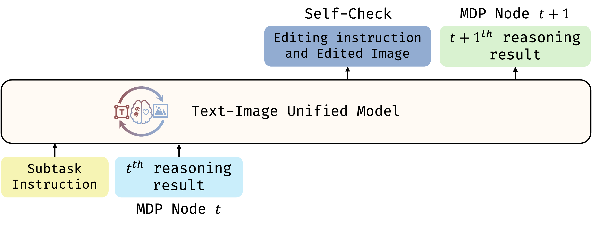
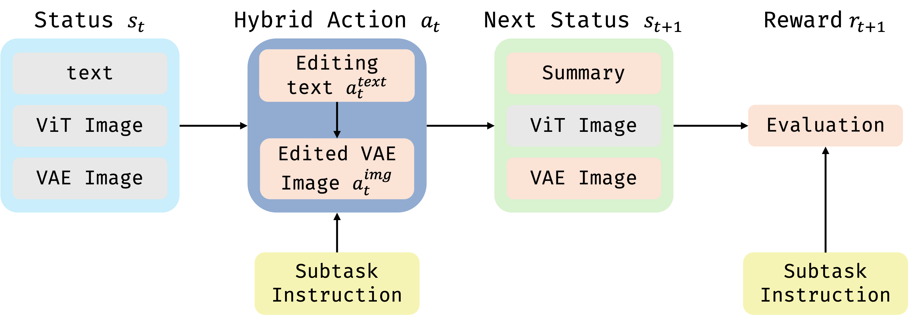

# <strong>B</strong><strong>A</strong><strong>T</strong><strong>I</strong>: <strong>B</strong><strong>A</strong>gel-based Unified Chain of Thought Across <strong>T</strong>ext and <strong>I</strong>mage

## Overview

**BATI** is a Unified Chain-of-Thought (UniCoT) reasoning framework designed to empower Multimodal Large Language Models (MLLMs) to perform complex reasoning across both text and vision. By decomposing multimodal tasks into interpretable, modular steps and executing them sequentially or in parallel, BATI target to enable unified multimodal reasoning for a wide range of applications, including:

* Complex visual planning and editing
* Geometric and physics-consistent reasoning
* Verification of image and video generation outcomes

<!-- ## Pipeline Summary -->
The BATI reasoning pipeline consists of the following stages:

1. **Planning**: Decompose the complex task into a sequence of simpler, manageable subtasks.
2. **Stepwise Execution**: Execute each subtask using the unified model with step-by-step reasoning.
3. **Self-Check**: After completing each subtask, perform a validation check to ensure the intermediate result aligns with the intended goal.
4. **Final Result**: Aggregate the validated intermediate results to produce the final output.

  

---

## Key Insight

During UniCoT learning, we observe that convergence becomes increasingly difficult as the reasoning chain grows longer across multimodal sequences. This is largely due to the token-intensive nature of image generation and understanding, which inflates the overall sequence length and leads to infeasible computational costs—particularly when the CoT process involves up to 10 image-text pairs as shown below.

  

To mitigate this challenge, we reformulate the UniCoT reasoning process as a **Markov Decision Process (MDP)**, where each step depends only on the current state and the corresponding task instruction. This formulation enables the model to focus on localized transitions between adjacent reasoning steps, significantly reducing complexity and improving training efficiency. Specifically, we define each reasoning step as an MDP node comprising a **state** (e.g., a text-image pair) and an **action** (e.g., an edit operation). The learning objective is thus simplified to modeling the transition dynamics between successive states, $s_t \rightarrow s_{t+1}$, without the burden of capturing long-range dependencies across the entire sequence.

  

---

## Details

### UniCoT MDP Node Design

Each MDP node is defined by the following components:

* **State ($s_t$)**: Captures the current context, encompassing both textual inputs and visual representations.
* **Action ($a_t$)**: A hybrid operation that involves generating editing instructions and performing corresponding image edits.
* **Next State ($s_{t+1}$)**: The updated context resulting from the applied action, including the edited image, updated textual summary, visual outputs, and latent representations.
* **Reward**: Calculated using a task-specific evaluation function that assesses alignment with the desired objective.

  

UniCOT components that requires loss during training are highlighted in pink.

### Training Strategy

With above design, our training focuses on three core objectives:

* Learning to generate **hybrid actions** (text and image edits) that drive reasoning progression.
* Predicting the **next state summary** given the current state and action.
* Estimating **reward** that reflect task completion and reasoning quality.

---

## Complexity Comparison

We compare the training complexity and convergence behavior of the proposed MDP-based UniCoT formulation with the traditional long-chain UniCoT reasoning. As illustrated below, when training the model from step 0 to 6000, the MSE loss of the MDP-based UniCoT decreases to [XXX], whereas the long-chain UniCoT only converges to [XXX]. Similarly, the cross-entropy (CE) loss reaches [XXX] for the MDP formulation compared to [XXX] for the baseline.

> *(To be updated: Insert quantitative/qualitative results, e.g., model perplexity, training loss, inference latency, etc.)*

Furthermore, after fine-tuning for 6000 steps, we evaluate both models on the WISE benchmark, which is specifically designed to assess the reasoning capabilities of Multimodal Large Language Models (MLLMs). As shown below, the MDP-based formulation significantly outperforms the long-chain UniCoT baseline in terms of training stability and final performance. This demonstrates that the MDP-based approach facilitates more efficient learning and generates higher-quality outputs.

> *(To be updated: Insert comparative figure/table)*
