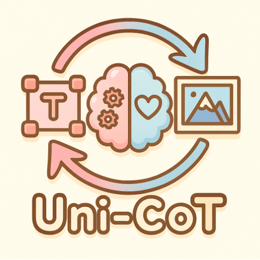

<p align="center">
  
</p>

# Uni-CoT: Towards Unified Chain-of-Thought Reasoning Across Text and Vision

<a href='https://github.com/SAIS-FUXI/projects'></a>
<a href='technical_report.md'></a>
<a href='https://huggingface.co'></a>

[Luozheng Qin](https://scholar.google.com/citations?user=41BWCzkAAAAJ&hl=zh-CN&oi=ao)<sup>1</sup><sup>\*</sup>,
[Jia Gong](https://scholar.google.com/citations?user=ZV-ThegAAAAJ&hl=zh-CN&oi=ao)<sup>1</sup><sup>\*</sup>,
[Yuqing Sun]()<sup>1</sup><sup>\*</sup>,
[Tianjiao Li](https://scholar.google.com/citations?hl=zh-CN&user=so6xMg8AAAAJ)<sup>3</sup>,
[Mengping Yang](https://scholar.google.com/citations?user=yF34LtcAAAAJ&hl=zh-CN&oi=ao)<sup>1</sup>,
[Xiaomeng Yang](https://scholar.google.com/citations?hl=zh-CN&user=7evPWQYAAAAJ)<sup>1</sup>,
[Zhiyu Tan](https://scholar.google.com/citations?user=XprTQQ8AAAAJ&hl=en)<sup>1,2</sup><sup>+</sup>,
[Hao Li](https://scholar.google.com/citations?user=pHN-QIwAAAAJ&hl=zh-CN)<sup>1,2</sup><sup>#</sup>,

\* equal contribution + project leader # Corresponding author 

<sup>1</sup>Shanghai Academy of AI for Science, <sup>2</sup>Fudan University, <sup>3</sup>Nanyang Technological University

## Overview
While Chain-of-Thought (CoT) reasoning has proven effective for complex text-based tasks, extending it to multimodal scenarios introduces new challenges. In visual contexts, human reasoning often relies on understanding how visual states evolve over time, such as tracking object movements and spatial interactions. This demands that Multimodal Large Language Models (MLLMs) reason not only at the textual level but also effectively incorporate and interpret visual cues.

To tackle this, we introduce **Uni-CoT**, a unified reasoning framework that extends CoT principles to the **multimodal domain**, empowering Multimodal Large Language Models (MLLMs) to perform **interpretable**, **step-by-step reasoning** across both **text and vision**. The core idea is to decompose complex multimodal tasks into structured, manageable steps that can be executed **sequentially or in parallel**, enabling more scalable and systematic reasoning as shown below.

<p align="center">
  
</p>

### 🧠 Reasoning Pipeline

The Uni-CoT framework adopts a four-stage modular reasoning process:

1. **Planning**: Decompose the overall task into a sequence of subtasks.
2. **Subtask Execution**: Solve each subtask with step-by-step multimodal reasoning.
3. **Self-Check**: Validate intermediate outputs before proceeding.
4. **Final Aggregation**: Integrate validated results into the final output.

### 🚀 Applications
The Uni-CoT framework aims to solve complex multimodal tasks, including:
* 🔍 Visual and physical reasoning
* 🧩 Visual planning
* 🎨 Reliable image generation and editing
* 📖 Multimodal story understanding

---
## ✅ To-Do: Uni-CoT Roadmap

A list of planned features and enhancements for the **Uni-CoT** framework:

### 🧠 Reasoning Framework
- [✅] Release self-check mechanism  
- [ ] Rlease planning and subtask execution mechanism
- [ ] Develop more fine-grained reasoning strategies  

### 🤖 Training Framework
- [ ] Provide SFT (Supervised Fine-Tuning) framework for multimodal reasoning  
- [ ] Provide RL (Reinforcement Learning) framework for multimodal reasoning  

### 📊 Evaluation & Benchmarking
- [✅] Evaluate Uni-CoT on a reasoning-based text-to-image generation benchmark [WISE](https://github.com/PKU-YuanGroup/WISE)
- [ ] Evaluate Uni-CoT on a reasoning-based editing benchmark
- [ ] Evaluate Uni-CoT on a reasoning-based understanding benchmark

---

## Preliminary Results for Reliable Image Generation
### Qualitative Results
<p align="left">
  

### Quantitative Results on Wise
|               | Culture↑ | Time↑   | Space↑  | Biology↑ | Physics↑ | Chemistry↑ | Overall↑ |
|---------------|----------|---------|---------|----------|----------|------------|----------|
| Janus         | 0.16     | 0.26    | 0.35    | 0.28     | 0.30     | 0.14       | 0.23     |
| MetaQuery     | 0.56     | 0.55    | 0.62    | 0.49     | 0.63     | 0.41       | 0.55     |
| Bagel         | 0.76     | **0.69** | <u>0.75</u> | 0.65     | <u>0.75</u> | <u>0.58</u>   | 0.70     |
| **Ours**      | **0.77** | <u>0.67</u> | <u>0.75</u> | **0.69** | **0.76** | **0.70**   | **0.73** |
| *GPT4O*       | *0.81*   | *0.71*  | *0.89*  | *0.83*   | *0.79*   | *0.74*     | *0.80*   |

---

## Quickstart

### Installation


### Model Download


### Self-check Reasoning


---
## Citation

```bibtex
@misc{Uni-CoT,
  author       = {SAIS-FUXI},
  title        = {Uni-CoT: Towards Unified Chain-of-Thought Reasoning Across Text and Vision},
  howpublished = {\url{https://github.com/Fr0zenCrane/BagelCoT}},
  year         = {2025},
  note         = {Accessed: 2025-07-28}
}

```
---
## Star History

[](https://star-history.com/#Fr0zenCrane/BagelCoT&Date)

---
## Acknowledgement

- This project is based on [Bagel](https://github.com/ByteDance-Seed/Bagel) proposed by ByteDance-Seed team. Bagel is a powerful and popular unified model for multimodal understanding and generation, making it an ideal foundation and startup for this project. We thank the ByteDance-Seed team for their outstanding work, which has made BATI possible.
