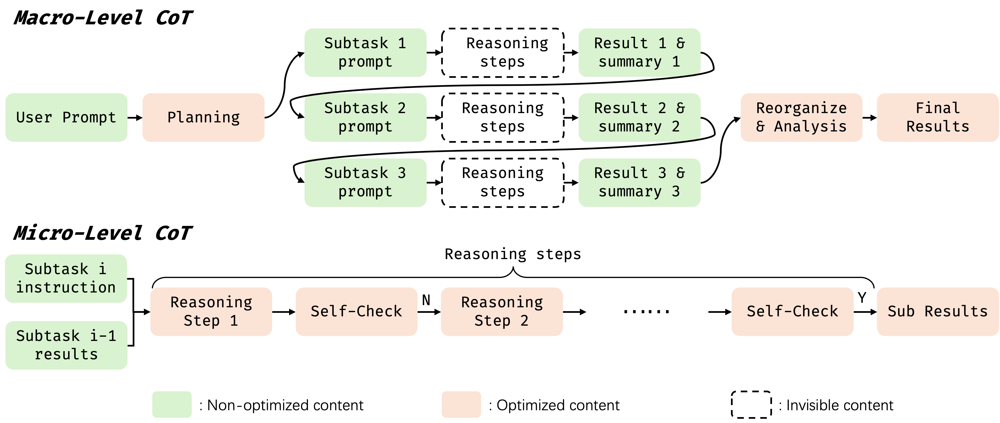

# **BATI**: **BA**gel-based Unified Chain of Thought Across **T**ext and **Image** 

[[Project]](https://github.com/SAIS-FUXI/projects) / [[Report]](technical_report.md) / [[Model]](https://huggingface.co)

## Overview

BATI is a Unified Chain-of-Thought (UniCoT) reasoning framework designed to empower Multimodal Large Language Models (MLLMs) to perform complex reasoning across both text and vision modalities.
By decomposing a given task into simple, modular steps and executing them sequentially or in parallel, BATI aims to enable unified large models to tackle a broad range of multimodal applications, including:

* Visual planning
* Geometric and physical reasoning
* Highly reliable image and video generation/editing

The BATI reasoning pipeline consists of the following stages:

1. **Planning**: Decompose the complex task into a sequence of simpler, manageable subtasks.
2. **Subtask Execution**: Execute each subtask using the unified model with step-by-step reasoning.
3. **Self-Check**: After completing each subtask, perform a validation check to ensure the intermediate result aligns with the intended goal.
4. **Final Result**: Aggregate the validated subtask results to generate the final output.

  

---
## ✅ To-Do: BATI Roadmap

A list of planned features and enhancements for the **BATI** framework:

### 🧠 Reasoning Framework
- [✅] Release self-check mechanism  
- [ ] Rlease dynamic task decomposition mechanism
- [ ] Develop more fine-grained reasoning decomposition strategies  

### 🤖 Training Framework
- [ ] Provide SFT (Supervised Fine-Tuning) framework for multimodal reasoning  
- [ ] Provide RL (Reinforcement Learning) framework for multimodal reasoning  

### 📊 Evaluation & Benchmarking
- [✅] Evaluate BATI on a reasoning-based text-to-image generation benchmark, wise.
- [ ] Evaluate BATI on a reasoning-based editing benchmark.
- [ ] Evaluate BATI on a reasoning-based understanding benchmark.

---

## Preliminary Results for Highly Reliable Image Generation
### Qualiative Results

  

### Quantitative Results

  

---

## Quickstart

### Installation

### Model Download

### Self-Reflect Generation

## Star History

## Acknowledgement

- This project is based on [Bagel](https://github.com/ByteDance-Seed/Bagel) proposed by ByteDance-Seed team. Bagel is a powerful and popular unified model for multimodal understanding and generation, making it an ideal foundation and startup for this project. We thank the ByteDance-Seed team for their outstanding work, which has made BATI possible.
