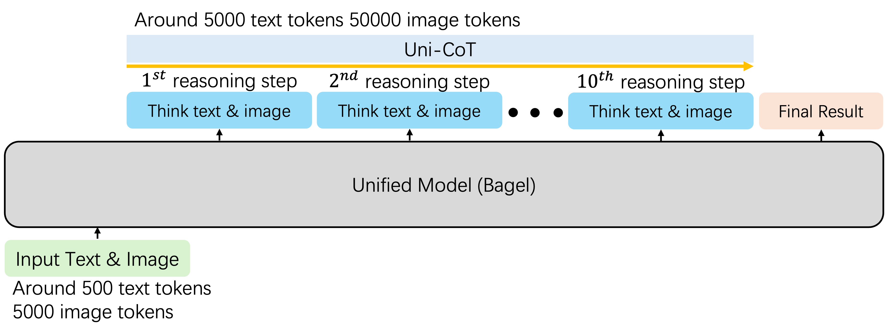
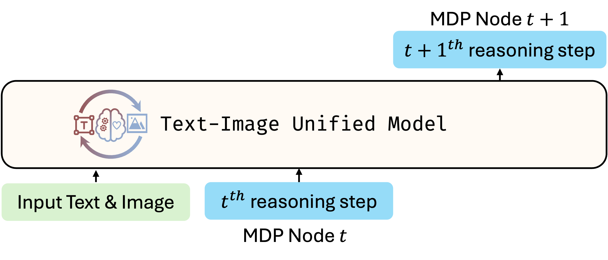
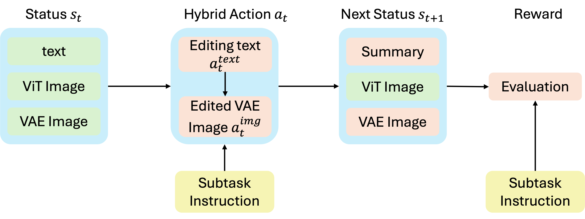
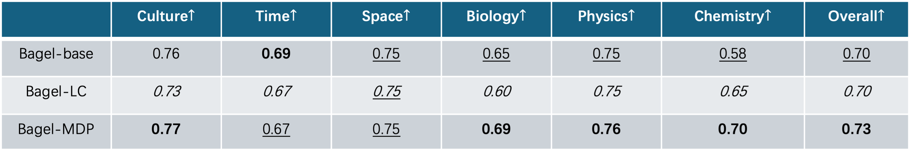

# <strong>B</strong><strong>A</strong><strong>T</strong><strong>I</strong>: <strong>B</strong><strong>A</strong>gel-based Unified Chain of Thought Across <strong>T</strong>ext and <strong>I</strong>mage

## Overview

BATI is a Unified Chain-of-Thought (UniCoT) reasoning framework designed to empower Multimodal Large Language Models (MLLMs) to perform complex reasoning across both text and vision modalities.
By decomposing a given task into simple, modular steps and executing them sequentially or in parallel, BATI aims to enable unified large models to tackle a broad range of multimodal applications, including:

* Visual planning
* Geometric and physical reasoning
* Highly reliable image and video generation/editing

<!-- ## Pipeline Summary -->
The BATI reasoning pipeline consists of the following stages:

1. **Planning**: Decompose the complex task into a sequence of simpler, manageable subtasks.
2. **Subtask Execution**: Execute each subtask using the unified model with step-by-step reasoning.
3. **Self-Check**: After completing each subtask, perform a validation check to ensure the intermediate result aligns with the intended goal.
4. **Final Result**: Aggregate the validated subtask results to generate the final output.

  

---

## Key Insight

A major challenge in UniCoT learning is the heightened complexity introduced by visual reasoning.
Each reasoning step involves not only generating explanatory text but also synthesizing a corresponding image. 
Producing a high-quality image via VAE consumes approximately 4,096 tokens, with an additional 1,369 tokens required for ViT-based representation, totaling nearly 6,000 tokens per step. 
This is a significant increase compared to the 512–1,024 tokens typically needed for text-only reasoning, substantially raising the cost of both training and inference. 
Consequently, when the reasoning chain grows with multiple image-text pairs, the model struggles to converge and generalize effectively, limiting its performance on multimodal tasks.

  

To mitigate the complexity introduced by long multimodal reasoning chains, we reformulate the UniCoT process as a Markov Decision Process (MDP), where each step depends solely on the current state. 
Concretely, we model each reasoning step as a discrete MDP node, which only depends on the preceding step and the task instruction. 
This formulation enables the model to focus on learning local transition dynamics between adjacent nodes, rather than capturing dependencies across the entire reasoning chain as shown below. 
Such a design choice significantly reduces computational overhead and improves training efficiency.

  

---

## Details

## UniCoT MDP Node Design

Each MDP node is defined by the following components:

* **State ($s_t$)**: Current context, refer to last reasoning step, including both text and images.
* **Action ($a_t$)**: A hybrid operation that involves generating editing instructions and performing corresponding image edits.
* **Next State ($s_{t+1}$)**: The updated context resulting from the applied action, including the edited image, a textual summary according to the edited image.
* **Reward ($r_{t+1}$)**: A textual conclusion or scalar score that quantifies the alignment between the outcome and the task objective.

  

UniCOT components that requires loss during training are highlighted in pink.

## Training Strategy

With above design, our training focuses on three core objectives:

* Learning to generate **hybrid actions** (text and image edits) that drive reasoning progression.
* Predicting the **next state summary** given the current state and action.
* Estimating **reward** that reflect task completion and reasoning quality.

---

## Comparison

We compare the proposed MDP-based UniCoT (BAGEL-MDP) against the traditional long-chain UniCoT reasoning baseline (BAGEL-LC). Both models are trained for 6,000 steps on a dataset of approximately 10,000 samples. Evaluation is conducted on the WISE benchmark, which is specifically designed to assess the reasoning capabilities of Multimodal Large Language Models (MLLMs). As shown below, the MDP-based formulation consistently outperforms the long-chain baseline across all metrics, demonstrating its superior learning efficiency and output quality.

  

